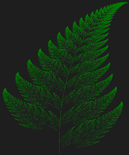
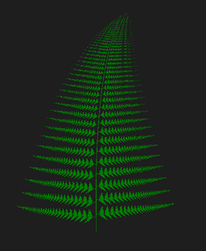
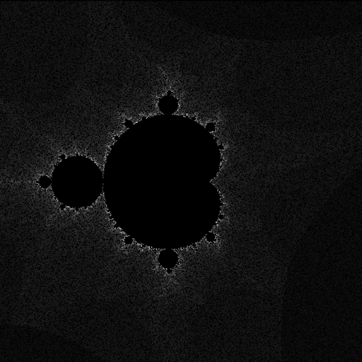

# Fractals
This is the repository contains the code for visualising the fractals which are never-ending patterns.

The [Chaos Game Video](https://www.youtube.com/watch?v=kbKtFN71Lfs&ab_channel=Numberphile) which got me interested in the whole Chaos theory and fractals.

Fractals are infinitely complex patterns that are self-similar across different scales. Driven by recurssion, fractals are images of dynamic systems- the picture of __Chaos__.   

Geometrically, they exist between our familiar dimensions.  

This code uses __pygame__ for rendering purpose. So, make sure to install it first.

## Contents

* __Barnsley Fern__: The folder contains the result images and the scripts to run it. Run ```render.py``` to run the code and visualise the formation of the fern in realtime.  
There are two types of fern which can be rendered:  
i> The original variant  
ii> The mutant variant  
You can make the changes in ```render.py``` to render different ferns.  
  
Here are the two results:  
   

* __Mandelbrot Set__: The folder contains the result image and a script to run it. Just run the ```Mandelbrot Set.py``` to run the code and visualise it's formation.  
You can make changes in it like increasing/decreasing the minimum and maximum values of x and y.  
You can also change the number of maximum iterations per complex number. The rendering will slow down but if you are patient enough, you will get better results.  

Here's a result obtained within 5 minutes of rendering with maximum iterations of 255:


I will be adding more types of fractals which are interesting and if I am able to code it :sweat_smile: